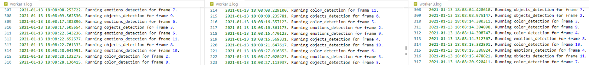

# Videos analysis pipeline

## Requirements

### Hardware Requirements

To be able to run the solution as smooth as possible, we recommend you have **at least** 16GB of RAM and 20GB of space, as well as a 4-core 8-threads processor.

We ran this solution using Docker with WSL 2, and assigned to this solution all the cores, 10GB of RAM and 8GB of swap. To do so, please go to `%UserProfile%` and create or edit a file named .wslconfig with the following lines:

```
[wsl2]
memory=10GB
swap=8GB
```

### GPU Support

If you are running this project on a Linux Debian-based distro and you have an NVIDIA GPU, you can opt for using GPU for running inferences.

This will reduce considerably the time needed for the models to perform detections.

To enable GPU support, you need to:

1. Run `sudo ./gpu.sh` script, located at project's root. This is a **one run only** script, so it's provided as a separate script and won't be run within any other execution.

2. Add `--gpu` flag to main script (see Script Execution section below)

### Software Requirements

In order to run the solution locally, you first need to make sure to meet the following requirements:

- [**Docker**](https://docs.docker.com/get-docker/) 
- [**docker-compose**](https://docs.docker.com/compose/install/)

To run the solution without using the video app, you may need:

- [**Postman**](https://www.postman.com/downloads/)

## Running the solution

We provide a script that will start the docker-compose environment and submit the three jobs. To run it, we need a Unix environment. Running on Windows 10, this can be achieved with [WSL2](https://docs.microsoft.com/en-us/windows/wsl/install-win10). 

### Script execution

```shell script
./run.sh [--gpu]
```

Adding `--gpu` flag will enable GPU inferences. Please, before enabling make sure to satisfy all pre-requisites.

> Logs generated by `docker-compose up` will be redirected to `src/logs`

> **Known issue:** In very rare occasions, when we run the solution using the script, Cassandra and Spark container creations might fail, showing an error message similar to the following:<br />
> `ERROR: for src_cassandra_1  Cannot start service cassandra: error while creating mount source path '/run/desktop/mnt/host/wsl/docker-desktop-bind-mounts/Ubuntu-20.04/920d8fc0a50a7b4a2fd38ad0c82b2c2011f70e61b29840357210feb521262bd0': mkdir /run/desktop/mnt/host/wsl/docker-desktop-bind-mounts/Ubuntu-20.04/920d8fc0a50a7b4a2fd38ad0c82b2c2011f70e61b29840357210feb521262bd0: file exists`
> <br />
>
> **This can be solved by restarting the WSL2 engine (restart LXssManager service).**

### Clearing entries

We also provide a complimentary script, named `clear_frames.py` which will clear frames older than N days (user defined) from the filesystem and all their related database entries.

**Usage**

`python clear_frames.py --days N`, with N being an integer
### Python files option

The script uses the `--py-files` option which provides the dependencies needed in each job. The ingest and
frames-storage jobs dependencies are bundled in the **cfg.zip** file, while the inference job dependencies are bundled in the **inference_dependencies.zip** file.

The [cfg.zip](src/spark/cfg.zip) file contains [cfg.py](src/spark/cfg.py), while
the [inference_helper.zip](src/spark/inference_dependencies.zip) file contains [cfg.py](src/spark/cfg.py)
, [inference_helper.py](src/spark/inference_helper.py) and the complete [models](src/spark/models/) folder.

> If we needed to modify either one of these python files, we must also update their version within the zip files. Otherwise, the changes will not affect the execution of the pipeline.

## Parallelization

To achieve parallel processing we must pay attention to the following topics:
- Having enough Spark workers assigned to each job
- Repartitioning the dataframe to match the amount of workers used.

### Workers

> In our local environment, we use just one worker for the ingest job, another one for the frames storage jobs, and two workers for the inference job. In a deployed solution we could scale this to the available number of workers, achieving parallel execution of the ingest flow and improving the performance of the inference job.

### Repartition

Once we have defined the amount of workers for each job, we need to repartition the kafka messages dataframe to match the amount of workers assigned to each one.

> In our testing environment, the inference job will repartition the frames received from kafka into two partitions to be able to send one partition to each worker.

> ```python
> analysis_df = frame_df.withColumn("model_to_run", explode_outer("models_to_run")) \
>        .withColumn("analysis", predict_udf(col("buffer"), col("model_to_run"), col("frame_number"))) \
>        .repartition(2) \
>        .withColumn("data", from_json("analysis", analysis_schema)) \
>        .select(col("video_id"), col("frame_number"), col("buffer"), col("timestamp").alias("video_timestamp"),
>                col("data.*"))
> ```

### Results

Having the previous information in mind we performed some tests one a VM with three workers assigned to the inference job and the repartition configured to 3.

In the following image we can see the logs obtained from the three workers which shows how a batch was partitioned into three and analyzed at the same time in each worker.



## API endpoints

- To submit the path to a video and start the video analysis lifecycle, make an HTTP POST request to:

    ```http request
    http://localhost:8000/analysis/start
    ```
  The body payload should be of Content-Type=application/json, and its content should be like the following example

  **Request Body**
    ```json
    {
      "videoURL": "https://www.exampleURL.com/video.mp4",
      "modelsToRun":["color_detection", "emotions_detection","objects_detection"],
      "videoName": "User defined name",
      "frameStep": 10
    }
    ```
- To get the video analysis status, make an HTTP GET request to:

    ```http request
    http://localhost:8000/analysis/{video_id}
    ```

- To get the video analysis results, make an HTTP GET request to:

    ```http request
    http://localhost:8000/analysis/{video_id}/results
    ```

- To get a video frame with the bounding boxes showing the analysis results, make an HTTP GET request to:

    ```http request
    http://localhost:8000/analysis/{video_id}/frame/{frame_number}
    ```
- To get the analysis results of a particular frame, make an HTTP GET request to:

    ```http request
    http://localhost:8000/analysis/{video_id}/frame/{frame_number}/results
    ```

- To obtain an RTMP endpoint for submitting a live stream, make an HTTP POST request to:

    ```http request
    http://localhost:8000/analysis/rtmp-endpoint
    ```
  The body payload should be of Content-Type=application/json, and its content should be like the following example

  **Request Body**
  ```json
    {
      "modelsToRun":["color_detection", "emotions_detection","objects_detection"],
      "frameStep":"10",
      "videoName":"RMTP streamed video"
    }
  ```

- To obtain a list of the completed videos, make and HTTP GET request to:

  ```http request
  http://localhost:8000/analysis/videos
  ```